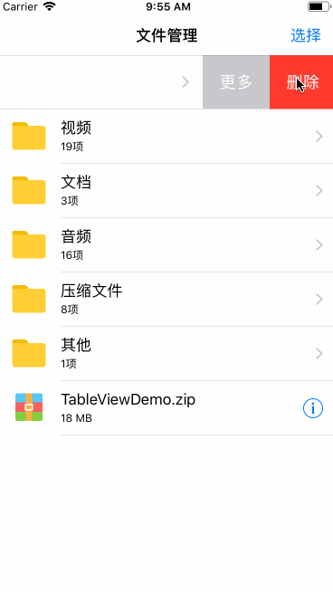

## TableViewDemo
1. 介绍**微信左滑删除的效果实现**
2. 介绍TableViewCell的常用样式及多选操作  

效果图(**因为效果图是在模拟器上录的，所以第二次的时候确认删除的动画会有点异常，在真机上不会出现这种问题**)  



## 微信左滑删除的效果实现
### 原理
iOS11推出的新api帮助开发者更方便的实现左滑的菜单效果，通过这个方法可以定义左滑的菜单和对应的点击事件

```
- (UISwipeActionsConfiguration *)tableView:(UITableView *)tableView trailingSwipeActionsConfigurationForRowAtIndexPath:(NSIndexPath *)indexPath{

}
```

当我们在创建一个action的时候，是这样创建的：

```
UIContextualAction *moreAction = [UIContextualAction contextualActionWithStyle:UIContextualActionStyleNormal title:@"更多" handler:^(UIContextualAction * _Nonnull action, __kindof UIView * _Nonnull sourceView, void (^ _Nonnull completionHandler)(BOOL)) {


}];
```

其中有一个参数block，这个block也是实现此效果最重要的部分，这个block它有3个参数：

> action: 这个指的就是我们创建的action对象 

> sourceView: 这个view非常重要，当action的title不为空时，sourceView是一个UILabel， 当action的title为空时，sourceView是一个UIButton（实际上是UISwipeActionStandardButton）

> completionHandler: 这个参数是一个block，这个block是一个细节了，不知道大家有没有注意到，在iOS11之前，只要你点击了左滑出现的任意一个按钮，cell都会退出编辑，也就是左滑按钮会消失，iOS11之后不会了，如果你想实现这个效果，只要回调一下`completionHandler`即可，参数是一个`BOOL`值，传YES和NO的区别是：传NO,系统只退出编辑，传YES ,如果是删除样式，系统会自动为你做删除cell操作。


### 实现
思路是，**创建一个Label，点击删除按钮时，将该Label加在sourceView最顶层父view上，即加在前面提到过的UISwipeActionPullView上，同时以UIView动画改变这个Label的frame**

```
- (UILabel *)confirmDeleteLabel{
    if (!_confirmDeleteLabel) {
        UILabel *label = [[UILabel alloc] init];
        label.text = @"确认删除";
        label.textAlignment = NSTextAlignmentCenter;
        label.textColor = [UIColor whiteColor];
        label.backgroundColor = [UIColor colorWithRed:250/255.0 green:62/255.0 blue:56/255.0 alpha:1];
        label.userInteractionEnabled = YES;
        _confirmDeleteLabel = label;
    }
    return _confirmDeleteLabel;
}

//API_AVAILABLE(ios(11.0))
- (UISwipeActionsConfiguration *)tableView:(UITableView *)tableView trailingSwipeActionsConfigurationForRowAtIndexPath:(NSIndexPath *)indexPath{
    UIContextualAction *deleteAction = [UIContextualAction contextualActionWithStyle:UIContextualActionStyleDestructive title:@"删除" handler:^(UIContextualAction * _Nonnull action, __kindof UIView * _Nonnull sourceView, void (^ _Nonnull completionHandler)(BOOL)) {
        
            // 核心代码
        UIView *rootView = nil; // 这个rootView指的是UISwipeActionPullView，最上层的父view
        if ([sourceView isKindOfClass:[UILabel class]]) {
            rootView = sourceView.superview.superview;
            self.confirmDeleteLabel.font = ((UILabel *)sourceView).font;
        }
        self.confirmDeleteLabel.frame = CGRectMake(sourceView.bounds.size.width, 0, sourceView.bounds.size.width, sourceView.bounds.size.height);
        [sourceView.superview.superview addSubview:self.confirmDeleteLabel];
        
        [UIView animateWithDuration:0.7 delay:0 usingSpringWithDamping:0.7 initialSpringVelocity:1 options:UIViewAnimationOptionCurveEaseInOut animations:^{
            CGRect labelFrame = self.confirmDeleteLabel.frame;
            labelFrame.origin.x = 0;
            labelFrame.size.width = rootView.bounds.size.width;
            self.confirmDeleteLabel.frame = labelFrame;
        } completion:^(BOOL finished) {
            
        }];
        
    }];
    
    UIContextualAction *moreAction = [UIContextualAction contextualActionWithStyle:UIContextualActionStyleNormal title:@"更多" handler:^(UIContextualAction * _Nonnull action, __kindof UIView * _Nonnull sourceView, void (^ _Nonnull completionHandler)(BOOL)) {
        
    }];
    
    UISwipeActionsConfiguration *config = [UISwipeActionsConfiguration configurationWithActions:@[deleteAction,moreAction]];
    config.performsFirstActionWithFullSwipe = NO;
    return config;
}
```

到这一步，动画效果已经实现，但是令人头疼的是点击事件的处理，给`确认删除Label`加手势或者换成`UIButton`都不会触发点击事件。虽然我们定义的`更多`和`删除`已经被确认删除遮挡，但是点击相应位置，执行的还是我们定义action时定义的事件。所以这里的解决方案是，当`确认删除Label`显示出来的时候，点击`更多`也执行`删除操作`。实现如下：

```
- (UISwipeActionsConfiguration *)tableView:(UITableView *)tableView trailingSwipeActionsConfigurationForRowAtIndexPath:(NSIndexPath *)indexPath{
    UIContextualAction *deleteAction = [UIContextualAction contextualActionWithStyle:UIContextualActionStyleDestructive title:@"删除" handler:^(UIContextualAction * _Nonnull action, __kindof UIView * _Nonnull sourceView, void (^ _Nonnull completionHandler)(BOOL)) {
        
        if (self.confirmDeleteLabel.superview) {
            [self.dataArr removeObjectAtIndex:indexPath.row];
            [self.mainTableView reloadData];
        } else {
            NSLog(@"显示确认删除Label");
            // 核心代码
            UIView *rootView = nil; // 这个rootView指的是UISwipeActionPullView，最上层的父view
            if ([sourceView isKindOfClass:[UILabel class]]) {
                rootView = sourceView.superview.superview;
                self.confirmDeleteLabel.font = ((UILabel *)sourceView).font;
            }
            self.confirmDeleteLabel.frame = CGRectMake(sourceView.bounds.size.width, 0, sourceView.bounds.size.width, sourceView.bounds.size.height);
            [sourceView.superview.superview addSubview:self.confirmDeleteLabel];
            
            [UIView animateWithDuration:0.7 delay:0 usingSpringWithDamping:0.7 initialSpringVelocity:1 options:UIViewAnimationOptionCurveEaseInOut animations:^{
                CGRect labelFrame = self.confirmDeleteLabel.frame;
                labelFrame.origin.x = 0;
                labelFrame.size.width = rootView.bounds.size.width;
                self.confirmDeleteLabel.frame = labelFrame;
            } completion:^(BOOL finished) {
                
            }];
        }
        
    }];
    
    UIContextualAction *moreAction = [UIContextualAction contextualActionWithStyle:UIContextualActionStyleNormal title:@"更多" handler:^(UIContextualAction * _Nonnull action, __kindof UIView * _Nonnull sourceView, void (^ _Nonnull completionHandler)(BOOL)) {
        
        if (self.confirmDeleteLabel.superview) {
            [self.dataArr removeObjectAtIndex:indexPath.row];
            [self.mainTableView reloadData];
        } else {
            NSLog(@"更多");
        }
        
    }];
    
    UISwipeActionsConfiguration *config = [UISwipeActionsConfiguration configurationWithActions:@[deleteAction,moreAction]];
    config.performsFirstActionWithFullSwipe = NO;
    return config;
}
```

### 细节调整
+ 左滑的效果有一个细节是，当你的手指左滑cell，一直往左滑动，最右边的删除按钮会变长，于是就导致`确认删除`的label不会展示出来。所以我们要设置`UISwipeActionsConfiguration`的属性`performsFirstActionWithFullSwipe`为`NO`

```
UISwipeActionsConfiguration *config = [UISwipeActionsConfiguration configurationWithActions:@[deleteAction,moreAction]];
config.performsFirstActionWithFullSwipe = NO;
```

+ 实现当左滑按钮已经出现时，再次左滑则移除我们添加的`确认删除Label`，这里我们采用的是获取tableView的左滑手势，然后给该手势增加一个方法如下：

```
for (UIGestureRecognizer *ges in self.mainTableView.gestureRecognizers) {
        if ([ges isKindOfClass:NSClassFromString(@"_UISwipeActionPanGestureRecognizer")]) {
            [ges addTarget:self action:@selector(_swipeRecognizerDidRecognize:)];
        }
    }

- (void)_swipeRecognizerDidRecognize:(UISwipeGestureRecognizer *)swipe{
    if (_confirmDeleteLabel.superview) {
        [_confirmDeleteLabel removeFromSuperview];
        _confirmDeleteLabel = nil;
    }
}
```

+ 修改左滑删除按钮的文字颜色和字体大小，系统虽然没有提供接口，但是我们可以在代理方法里面获取到这个控件，然后对其进行个性化定制。如下：

```
//  在这个代理方法里，可以获取左滑按钮，进而修改其文字颜色，大小等
- (void)tableView:(UITableView *)tableView willBeginEditingRowAtIndexPath:(NSIndexPath *)indexPath {
    NSLog(@"将要开始编辑cell");
    
    for (UIView *subView in tableView.subviews) {
        if ([subView isKindOfClass:NSClassFromString(@"UISwipeActionPullView")]) {
            for (UIView *childView in subView.subviews) {
                if ([childView isKindOfClass:NSClassFromString(@"UISwipeActionStandardButton")]) {
                    UIButton *button = (UIButton *)childView;
                    button.titleLabel.font = [UIFont systemFontOfSize:18];
                }
            }
        }
    }
    
}
```

## TableView的常用样式及多选操作
### 实现cell的多选操作
```
//开始选择
[self.mainTableView setEditing:YES animated:YES];

//结束选择
[self.mainTableView setEditing:NO animated:YES];

-(UITableViewCellEditingStyle)tableView:(UITableView *)tableView editingStyleForRowAtIndexPath:(NSIndexPath *)indexPath{
	return UITableViewCellEditingStyleDelete | UITableViewCellEditingStyleInsert;
}

//选中和取消选中
- (void)tableView:(UITableView *)tableView didSelectRowAtIndexPath:(NSIndexPath *)indexPath{
}
- (void)tableView:(UITableView *)tableView didDeselectRowAtIndexPath:(NSIndexPath *)indexPath{
}
```

### cell右边的箭头和详情按钮
```
cell.accessoryType = UITableViewCellAccessoryDisclosureIndicator;
cell.accessoryType = UITableViewCellAccessoryDetailButton;

//UITableViewCellAccessoryDetailButton的点击事件
- (void)tableView:(UITableView *)tableView accessoryButtonTappedForRowWithIndexPath:(NSIndexPath *)indexPath{
}
```
